# FEAther 

A Rhino3D plugin sponsored by [Nano3DTech](https://nano3dtech.com/).

# Table of contents

1. [Installation](#installation)
   1. [Trial](#trial)
   1. [Commercial](#commercial)
1. [How to use](#how-to-use-it)
   1. [Video guide](#video-guide)
1. [Known issues](#known-issues)
1. [Why this plugin](#why-this-plugin)
1. [Commands](#commands)
   1. [`FeatherPrintable` command](#featherprintable-command)
       1. [3D print process](#3d-print-process)
       1. [3D print process analysis](#3d-print-process-analysis)
       1. [Verification by Abaqus](#verification-by-abaqus)
   1. [`FeatherCastable` command](#feathercastable-command)
       1. [Casting process](#casting-process)
   1. [`FeatherUsable` command](#featherusable-command)

# Installation

## Trial

If you like to try it, simply visit the [plugin page](https://www.food4rhino.com/en/app/feather). Then log in and push the `install` button in front of latest released version. Or alternatively, do these:

1. Use `_PackageManager` command on Rhino3D commandline.
1. Search for plugin name i.e. `Feather`.
1. The plugin will be listed through the package manager UI.
1. Click the install button.

## Commercial

If you like to purchase it, simply do these:

1. Visit the online shop [here](https://www.patreon.com/Megidd/shop).
1. Download the compressed file.
1. Extract the compressed file.
1. Use Rhino3D `PlugInManager` command to lunch the corresponding UI.
1. Click on `Install...` button.
1. Select the `RHP` file inside the extracted folder to install it.

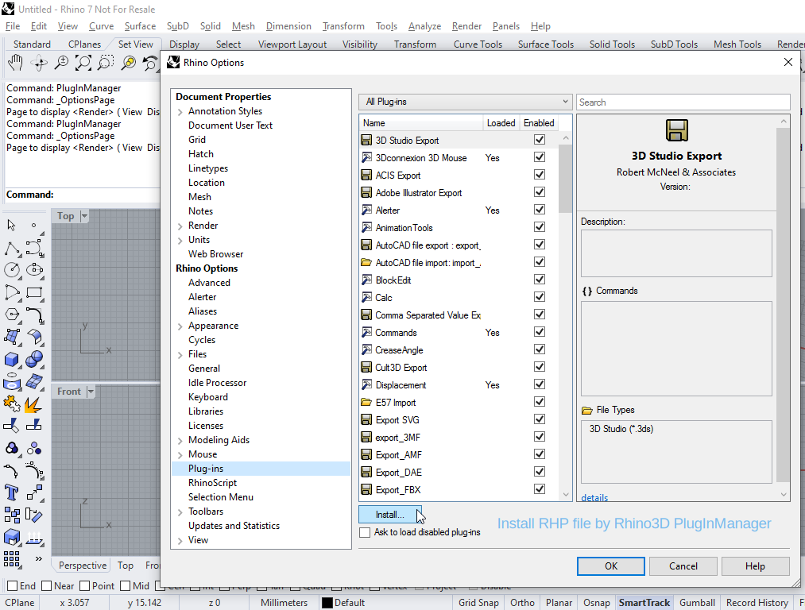

# How to use it

Once the plugin is installed, its commands can be accessed by typing the plugin name on command line. Start typing `Feather` on Rhino3D command line to auto complete the plugin commands.

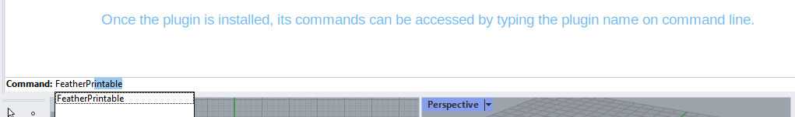

## Video guide

The following video demonstrates how to use the plugin commands after installation.

# Known issues

It's still work-in-progress. There are known issues like this: https://github.com/Megidd/Feather/issues/2

# Why this plugin?

The digital designers use 3D software like Rhino. But, they don’t have any engineering knowledge to predict if their designs would be acceptable regarding:

1. Manufacturing.
   1. 3D print process for prototyping.
   1. Casting process for mass production.
1. Consumption.
   1. Usage process under environment loads.

The manufacturing process consists of prototyping and mass production. It requires engineering knowledge to figure out if a digital 3D design would be acceptable. Moreover, predicting the suitability for consumption requires engineering analysis. The 3D designers are digital artists. They are not equipped with the required engineering knowledge to predict the vulnerability of their digital designs. This plugin tries to bridge this gap by providing a convenient tool for digital artists.

# Commands

This plugin offers multiple commands helping with multiple aspects of manufacturing of 3D designs:

1. `FeatherPrintable` command to optimize 3D print process.
   * Making sure your 3D print will be done correctly.
1. `FeatherCastable` command to optimize casting process.
   * Making sure your casting will be done correctly[^1].
1. `FeatherUsable` command to optimize usage process.
   * Making sure your 3D model has maximum strength and minimum weight[^1].

## `FeatherPrintable` command

This command helps you with the 3D print workflow by FEA, finite element analysis. It means you can analyze your 3D model layer-by-layer almost the way it's 3D printed slice-by-slice.

### 3D print process

The 3D print process is usually done by a print floor moving up from a resin tank. The 3D model is solidified layer-by-layer and is created upside-down.

### 3D print process analysis

By `FeatherPrintable` command, at each layer, you will see a graph showing the Von Mises stress throughout the 3D model. You would be able to compare the stress with the ultimate stress of the resin material. This way, you can precisely estimate whether your 3D print process will collapse or not. For example, figure below indicates the analysis for a specific layer.

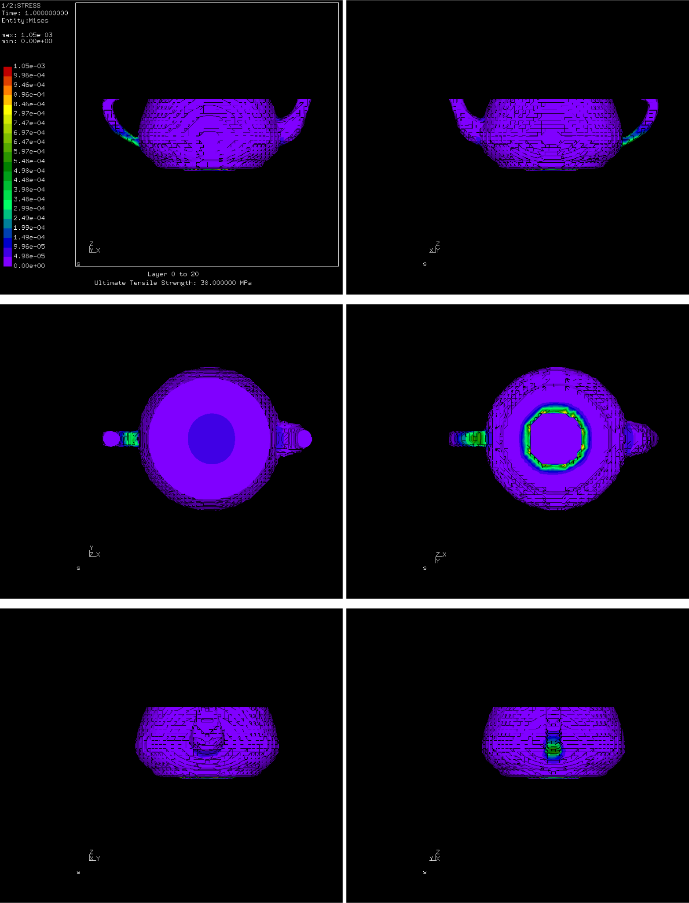

The comparison of analysis for different layers of a sample 3D model is displayed below. The figure shows the 3D model being printed along the `+Z` axis. The only force acting upon the 3D model is gravity in `+Z` direction. It should be noted that 3D print process is usually done by a print floor moving up layer-by-layer while creating the 3D model in an upside-down fasion. The very first layer of 3D model is touching the print floor. So, the first layer is a restrained boundary condition.

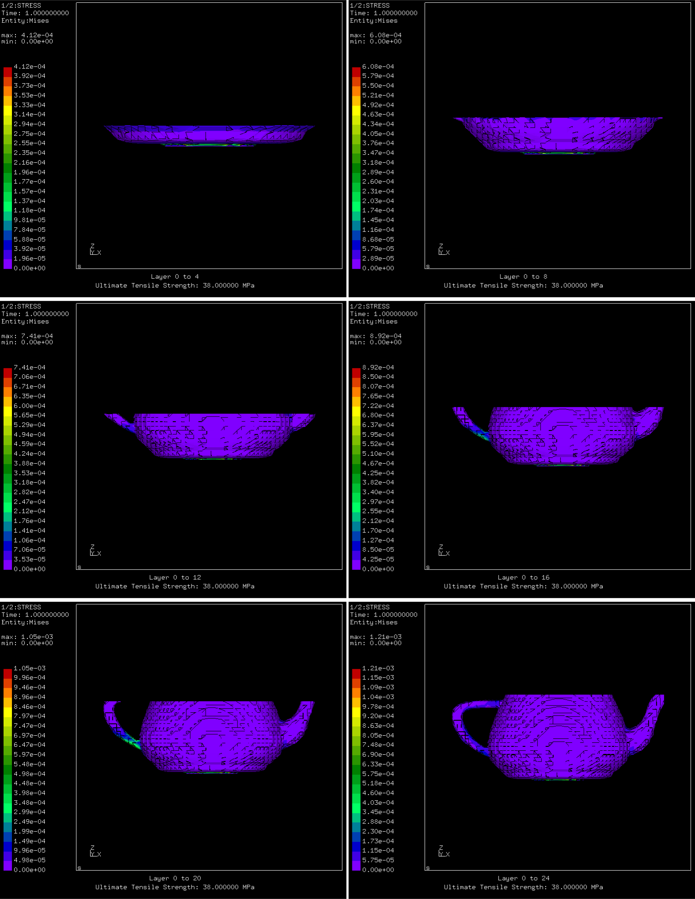

### Verification by Abaqus

The verification is done by Abaqus software. For a single layer, FEAther result is compared with Abaqus one. They are matching. The left side is the FEAther result for a single layer and the right side is the Abaqus one.

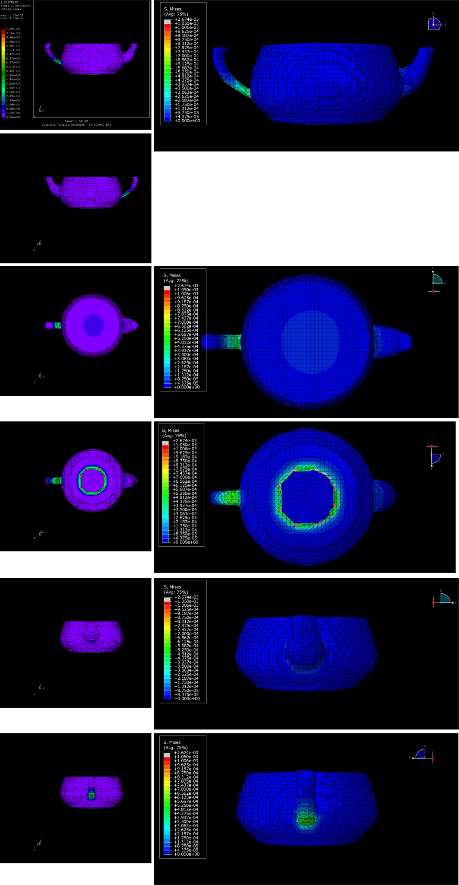

## `FeatherCastable` command

This command helps you optimize the 3D model for the casting process[^1]. For example, you will be informed if the thickness of 3D model parts are too thin depending upon the casting technology being used among vaccum, centrifuge, and induction technologies.

### Casting process

The casting is used by multiple industries. Let's focus on the jewelry industry which employs it for mass production. At the jewelry workshops, the following workflow is employed by the workshop staff to manufacture the jewelry design in large quantities.

A digital design is created by the artistic designer. An experienced expert will check the digital design. To check for manufacturing and consumption bugs. A 3D print of the digital design is printed as the prototype. Plastic samples are produced by replicating the 3D printed prototype.

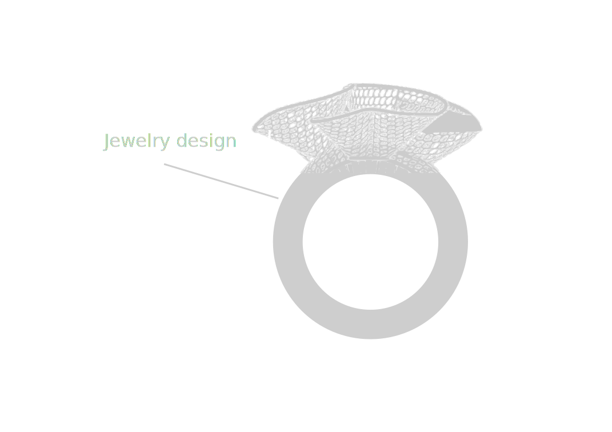

Sprues and other routes are added to the plastic samples to help with the metal casting. Sprues are added before attaching the plastic samples to a plastic tree. Plastic samples will be connected to the tree branches through connection points.

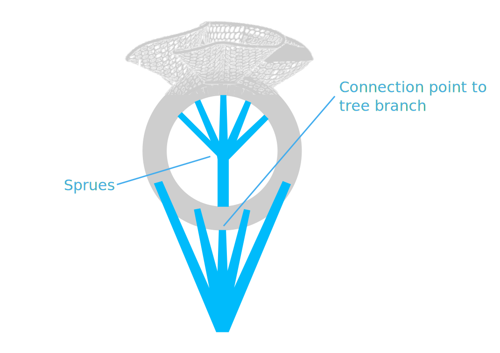

Plastic samples are attached to a plastic tree. The plastic samples are directly connected to tree branches. The tree branches are connected to the tree trunk. The tree would provide the necessary routes for the metal casting process.

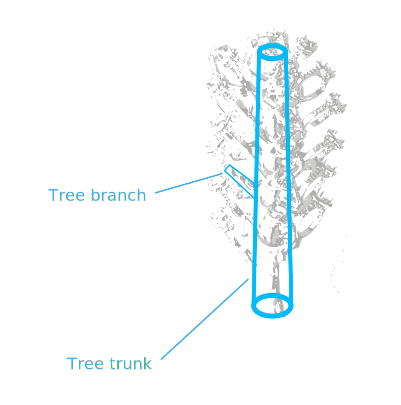

A flask cylinder would be the container for the plastic tree. Gypsum plaster would be poured into the flask to contain around the plastic tree. An oven is used to heat the flask and create negative/empty volumes. Casting of the gold metal is done into the empty volumes of the flask. Post processing and cleanup is done.

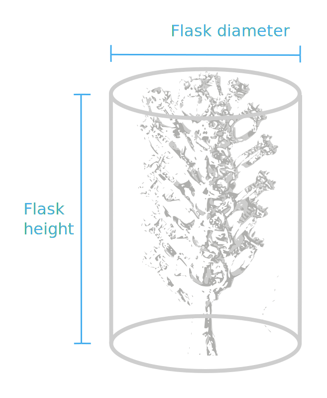

### Casting process analysis

By `FeatherCastable` command, you can analyze the casting process throughout your 3D model by simulating the mold filling and the fluid flow[^1]. Mold filling affects the quality of a casting. The fluid flow phenomena are closely related to the casting quality and surface finish. The dimensional accuracy of a casting and die life is also influenced by the fluid flow in the mold cavity. The metal flow pattern affects the temperature distribution of the mold cavity, which in turn would affect the solidification process.

Modeling of the mold filling could be complex due to multiple physical phenomena which need to be considered such as free surface flow, turbulence, surface tension and combination of fluid flow with heat transfer. To take all the necessary parameters into account, the simulation tends to become complicated. When the development is done, a reliable analysis tool will be provided.

## `FeatherUsable` command

This command helps you optimize the usability of 3D model[^1]. You can strengthen the model while decreasing its weight. The finite element analysis - FEA - along with topology optimization are the technologies under the hood. An optimized 3D model will be generated. Some elements of the original 3D model are removed without affecting the required strength.

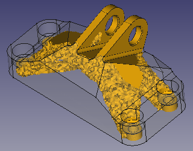

When its development is finished, it will provide an alternative for what Frustum does. The figure below is taken from Frustum.

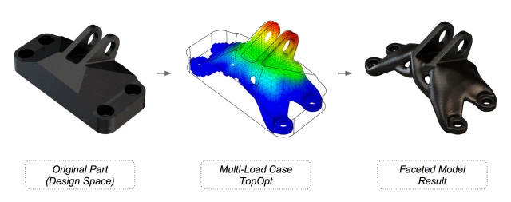

[^1]: This command is not available yet. It's being developed.
